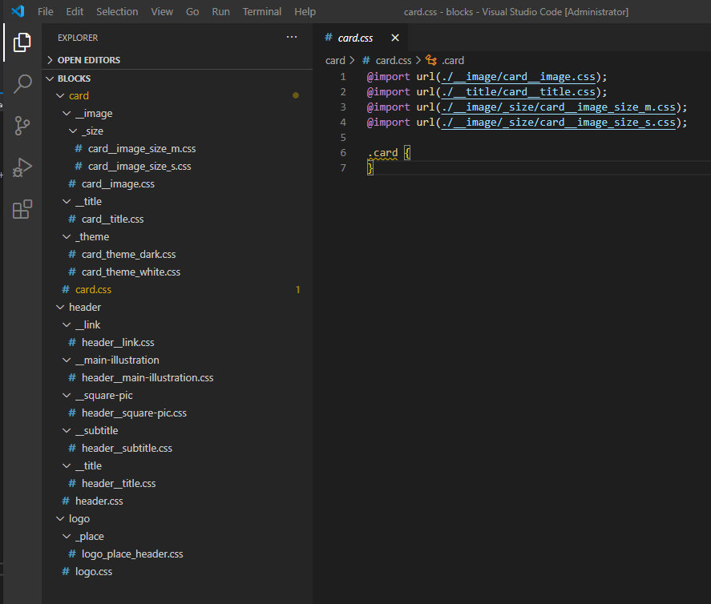

# БЭМ генератор

## Функицональность

Приложение позволяет пользователю на основе разметки построить структуру катологов и файлов по методологии [БЭМ nested](https://ru.bem.info/methodology/)

## Использование

1. Соберите проект под Ваши требования или скачайте готовую [сборку](_Realease/Bem-generator.exe)
2. Вставьте разметку Блока, Элементов и их Модификаторов
3. Выберите директорию для размещения структуры
4. Нажмите "Создать структуру" 

## Пример использования

